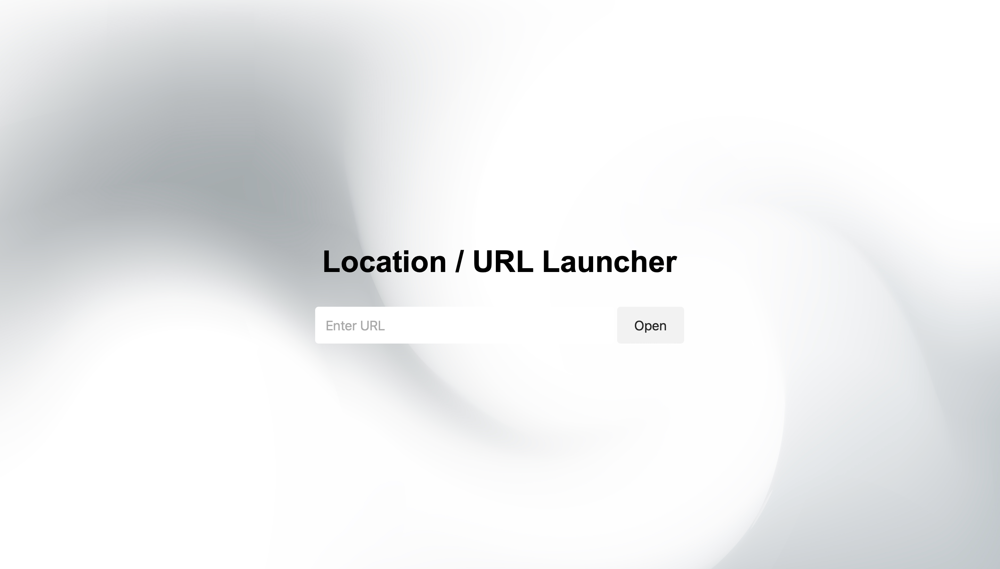

# URL Launcher

A simple web-based tool to quickly open URLs in a new browser tab. Automatically adds "https://" if the prefix is missing.

https://azrakarakaya1.github.io/URL_Launcher/

## Features

- Clean, minimalist interface
- Automatically prepends "https://" if not provided
- Opens URLs in a new tab
- Responsive design that works on different screen sizes
- Attractive background with centered layout

## How to Use

1. Enter a URL in the input field (with or without "http://" or "https://")
2. Click the "Open" button
3. The URL will open in a new browser tab

## Installation

No installation required, this is a client-side web application. Simply:

1. Clone this repository or download the files
2. Open `index.html` in any modern web browser

## Technologies Used

- HTML5
- CSS3
- JavaScript (ES6)
